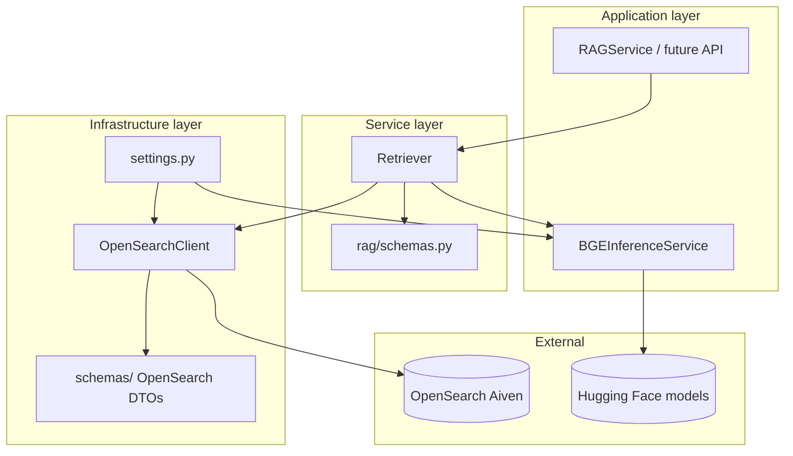

# Project structure

> **Version:** 2026-06-09  
> **See also:** [Development philosophy](./development-philosophy.md), [Roadmap and refactors](./roadmap-and-refactors.md)

## Repository layout

```
disease-diagnosis-rag-system/
├── docs/                          # Contributor documentation (you are here)
├── indices/
│   └── diseases/
│       └── init_mapping.json      # OpenSearch field mappings (source of truth)
├── models/                        # Downloaded HF models (gitignored)
├── src/
│   ├── settings.py                # Env-based config (OpenSearch, models, retrieval)
│   ├── db/
│   │   └── vector_db/
│   │       ├── base.py            # VectorDB protocol
│   │       └── opensearch.py      # Sync + async OpenSearch clients
│   ├── schemas/                   # OpenSearch wire/response models (shared infra)
│   │   ├── base.py                # RWSBaseModel, ORSBaseModel
│   │   ├── opensearch_responses.py
│   │   └── search_pipelines.py
│   ├── migrations/
│   │   └── init_db.py             # Index + alias + search pipeline bootstrap
│   └── services/
│       ├── ai_inference/
│       │   └── bge/
│       │       └── service.py       # BGE query embedding
│       └── rag/
│           ├── preprocess.py      # Query normalization + synonyms
│           ├── ingest.py          # Document views + bulk upsert
│           ├── retrieve.py        # Retriever (BM25 / k-NN / hybrid)
│           ├── pipeline.py        # RAGService orchestration
│           └── schemas.py         # Retrieval request/response DTOs
├── pyproject.toml
├── README.md
└── .env                           # Local secrets (not in git)
```

## Layer responsibilities



| Layer | Path | Responsibility |
|-------|------|----------------|
| **Settings** | `src/settings.py` | Secrets, paths, retrieval defaults, model download |
| **DB / vector store** | `src/db/vector_db/` | Thin OpenSearch client; no business logic |
| **OpenSearch schemas** | `src/schemas/` | Parse/serialize OpenSearch API bodies (RWS / ORS) |
| **RAG schemas** | `src/services/rag/schemas.py` | Retrieval requests, slim `RetrieveResult`, experiment DTOs |
| **AI inference** | `src/services/ai_inference/` | Model loading and embedding (BGE today; reranker later) |
| **RAG service** | `src/services/rag/service.py` | Retrieval orchestration, future ingest/rerank/generate |
| **Migrations** | `src/migrations/` | Idempotent index/pipeline setup scripts |
| **Index definitions** | `indices/` | JSON mappings versioned in git |

## Key modules in detail

### `src/db/vector_db/opensearch.py`

- **`OpenSearchClient`** — sync; used by migrations, scripts, notebooks
- **`AsyncOpenSearchClient`** — async; reserved for future FastAPI handlers
- Methods: index CRUD, aliases, search pipelines, `query()`, `bulk()`

### `src/schemas/` (OpenSearch infrastructure)

| Model base | Direction | Method |
|------------|-----------|--------|
| `RWSBaseModel` | App → OpenSearch | `to_dict()` |
| `ORSBaseModel` | OpenSearch → App | `from_opensearch()` |

Used for search pipeline bodies, mapping responses, and raw search responses.

### `src/services/rag/schemas.py`

Domain-specific retrieval DTOs:

- **Requests:** `Bm25RetrieveRequest`, `VectorRetrieveRequest`, `HybridRetrieveRequest` — each builds OpenSearch Query DSL via `to_search_body()`
- **Production response:** `RetrieveResult` — `hits` + optional `took_ms`
- **Experiment response:** `ExperimentModeResult`, `ExperimentCompareResponse` — adds mode, totals, optional debug body

### `src/services/rag/`

| Module | Status | Owner |
|--------|--------|-------|
| `schemas.py` | Done | Retrieval — request/response DTOs |
| `preprocess.py` | Done | Retrieval — query normalization + synonyms |
| `retrieve.py` | Done | Retrieval — BM25, k-NN, hybrid, experiments |
| `pipeline.py` | Partial | Retrieval — `RAGService.query()` only |
| `ingest.py` | Stub | Other dev — `DiseaseDocument`, `BulkIngestRequest` contracts |


### `indices/diseases/init_mapping.json`

OpenSearch document shape:

| Field | Type | Purpose |
|-------|------|---------|
| `keyword_text` | text | BM25 lexical search |
| `embedding` | knn_vector (384) | Semantic search (cosine) |
| `symptoms` | keyword | Structured symptoms (display / rerank) |
| `disease`, `description` | text | Display + LLM context |
| `severity`, `precautions` | keyword | Metadata / LLM context |

## Data flow: retrieval (implemented)

1. Caller builds a `HybridRetrieveRequest` (or BM25 / vector variant).
2. `BGEInferenceService.embed_query()` produces a 384-dim vector with the BGE search prefix.
3. Request schema builds OpenSearch Query DSL.
4. `OpenSearchClient.query()` runs search; hybrid passes `search_pipeline=hybrid-rrf`.
5. Hits are normalized into `RetrieveHit` → `RetrieveResult`.

## What is intentionally not in `src/schemas/`

RAG domain models live under `src/services/rag/` so OpenSearch infrastructure stays reusable and separate from product logic. If the project grows, see [Roadmap and refactors](./roadmap-and-refactors.md).

## Changelog

| Date | Change |
|------|--------|
| 2026-06-09 | Initial structure guide reflecting services/ layout and slim RetrieveResult |
