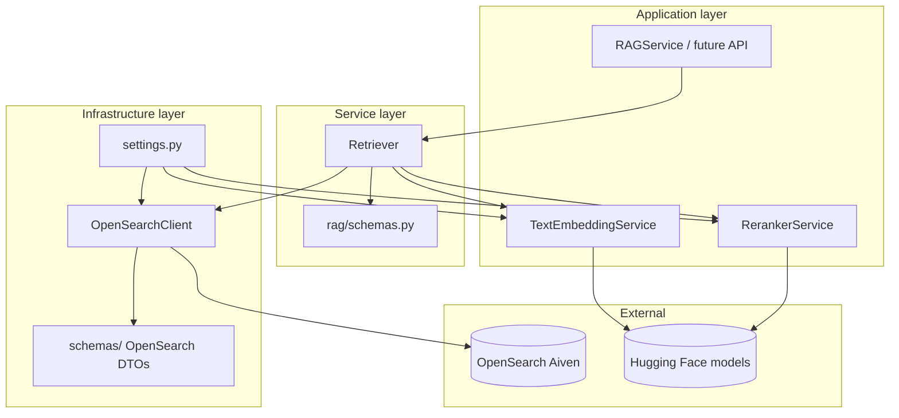

# Project structure

> **Version:** 2026-06-25
> **See also:** [Development philosophy](./development-philosophy.md), [Roadmap](./roadmap-and-refactors.md)

## Repository layout

```
disease-diagnosis-rag-system/
├── docs/                          # Contributor documentation (you are here)
├── indices/
│   └── diseases/
│       ├── init_mapping.json          # Symptom2Disease mapping (bootstrap)
│       └── ddxplus_mapping.json       # DDXPlus mapping (active)
├── data/
│   └── kb/                        # Committed KB artifacts (kb_ddxplus.json)
├── experiments/
│   └── exp02/                     # Offline retrieval eval scripts + results
├── models/                        # Downloaded HF models (gitignored)
├── src/
│   ├── settings.py                # Env-based config (OpenSearch, models, retrieval)
│   ├── db/
│   │   └── vector_db/
│   │       ├── base.py            # VectorDB protocol
│   │       └── opensearch.py      # Sync OpenSearch client
│   ├── schemas/                   # OpenSearch wire/response models (shared infra)
│   │   ├── base.py                # RWSBaseModel, ORSBaseModel
│   │   ├── opensearch_responses.py
│   │   └── search_pipelines.py
│   ├── migrations/
│   │   ├── init_db.py             # Index + alias + search pipeline bootstrap
│   │   └── migrate_ddxplus_index.py
│   └── services/
│       ├── inference/
│       │   ├── embeddings/
│       │   │   └── service.py     # Text query + document embedding
│       │   └── reranker/
│       │       └── service.py     # Cross-encoder reranker
│       └── rag/
│           ├── preprocess.py      # KB text builders + PreprocessPipeline (query path)
│           ├── ingest.py          # Normalize, embed, bulk upsert
│           ├── retrieve.py        # Retriever (BM25 / k-NN / hybrid / rerank)
│           ├── pipeline.py        # RAGService (ingest, retrieve → rerank)
│           ├── exceptions.py      # RAG domain exceptions
│           └── schemas.py         # Retrieval request/response DTOs
├── pyproject.toml
├── tests/                         # pytest suite (mocked OpenSearch + models)
│   ├── conftest.py
│   └── rag/
│       ├── conftest.py
│       ├── retrieve.py            # Retriever unit tests
│       ├── rerank.py              # Rerank + RetrieveHit.passage_text tests
│       ├── ingest.py              # Ingestion unit tests
│       └── pipeline.py            # RAGService unit tests
├── notebooks/
│   ├── walkthrough.ipynb          # Ingest + retrieval + rerank walkthrough
│   └── exp02_live_eval.ipynb      # Live OpenSearch eval vs EXP-02 baselines
├── README.md
└── .env                           # Local secrets (not in git)
```

## Layer responsibilities



| Layer | Path | Responsibility |
|-------|------|----------------|
| **Settings** | `src/settings.py` | Secrets, paths, retrieval defaults, model download |
| **DB / vector store** | `src/db/vector_db/` | Thin OpenSearch client; no business logic |
| **OpenSearch schemas** | `src/schemas/` | Parse/serialize OpenSearch API bodies (RWS / ORS) |
| **RAG schemas** | `src/services/rag/schemas.py` | Retrieval requests, slim `RetrieveResult`, experiment DTOs |
| **Inference** | `src/services/inference/` | Text embeddings (`embed_query`, **`embed_queries`** batch) and cross-encoder reranker |
| **RAG service** | `src/services/rag/` | Ingestion, retrieval, rerank orchestration; generate pending |
| **Migrations** | `src/migrations/` | Idempotent index/pipeline setup scripts |
| **Index definitions** | `indices/` | JSON mappings versioned in git |

## Key modules

### `src/db/vector_db/opensearch.py`

- **`OpenSearchClient`** — sync; used by migrations, scripts, notebooks, and services
- Under the hood: `opensearchpy.OpenSearch` → `Transport` → **`Urllib3HttpConnection`** → `urllib3.HTTPSConnectionPool` (HTTP to Aiven, not a custom wire protocol)
- Client kwargs from settings: `OPENSEARCH_TIMEOUT`, **`OPENSEARCH_POOL_MAXSIZE`** (`pool_maxsize`; default urllib3 pool is 1 connection — raise for parallel searches)
- FastAPI routes offload blocking work with `asyncio.to_thread` at the service boundary
- Methods: index CRUD, aliases, search pipelines, `query()`, `bulk()`

### `src/schemas/` (OpenSearch infrastructure)

| Model base | Direction | Method |
|------------|-----------|--------|
| `RWSBaseModel` | App → OpenSearch | `to_dict()` |
| `ORSBaseModel` | OpenSearch → App | `from_opensearch()` |

Used for search pipeline bodies, mapping responses, and raw search responses.

### `src/services/rag/schemas.py`

Domain-specific retrieval DTOs:

- **Requests:** `Bm25RetrieveRequest`, `VectorRetrieveRequest`, `HybridRetrieveRequest` — each builds OpenSearch Query DSL via `to_search_body()`. Vector/hybrid requests carry an optional `embedding`; the retriever sets it before calling `to_search_body()`.
- **Experiment request:** `RetrieveExperimentRequest` — shared query, optional fixed `embedding`, `modes` list
- **Production response:** `RetrieveResult` — `hits` + optional `took_ms`
- **Hit model:** `RetrieveHit` — requires `doc_id`, `disease`, `severity`, and `source`; optional `symptoms`, `antecedents`, `description`. Incomplete OpenSearch hits are skipped in `_build_hits`. `passage_text` builds symptom-first reranker input.
- **Experiment response:** `ExperimentCompareResponse` — `results: dict[RetrievalMode, ExperimentModeResult]` plus `modes_run` helper
- **Ingest:** `DiseaseDocument`, `BulkIngestRequest` — normalize at ingest, embed `embed_text`, bulk upsert via `Ingestion` / `RAGService.ingest()`
- **Internal:** `SearchExecution` — used by `Retriever` execute helpers

### `src/services/rag/` modules

| Module | Status | Owner |
|--------|--------|-------|
| `schemas.py` | Done | Retrieval — request/response DTOs |
| `preprocess.py` | Done | KB build helpers + `PreprocessPipeline` (`preprocess_query` free-text; `preprocess_ddxplus_evidence` for eval/KB) |
| `retrieve.py` | Done | Retrieval — BM25, k-NN, hybrid, `run_experiment()`, `rerank()`. Constructor: `Retriever(client, embed_service, preprocess, rerank_service=None)` |
| `pipeline.py` | Partial | Production — `RAGService.ingest()`, `RAGService.query()` (retrieve → rerank); generate pending |
| `exceptions.py` | Done | Domain errors (e.g. `RerankerNotConfigured`) |
| `ingest.py` | Done | Data team — `Ingestion` (normalize, embed, chunked bulk upsert) |

### Index mappings (`indices/diseases/`)

Two mapping files versioned in git. Retrieval always queries the `diseases` **alias**.

| Mapping file | Physical index | Dataset |
|--------------|----------------|---------|
| `init_mapping.json` | `init_diseases` | Symptom2Disease (24 disease classes) |
| `ddxplus_mapping.json` | `ddxplus_diseases` | DDXPlus (49 pathologies) — **active** |

See [DDXPlus index mapping](../ddxplus-index-mapping.md) for full field reference.

## Data flow: retrieval

1. Caller builds a `HybridRetrieveRequest` (or BM25 / vector variant)
2. `Retriever` preprocesses the query via injected `PreprocessPipeline` (`preprocess.py`)
3. For vector/hybrid: `Retriever` sets `request.embedding` (caller-supplied, or `TextEmbeddingService.embed_query()` / batched `embed_queries()` with the BGE search prefix)
4. Request schema builds OpenSearch Query DSL via `to_search_body()`
5. `OpenSearchClient.query()` runs search; hybrid passes `search_pipeline=hybrid-rrf`
6. Hits with complete required `_source` fields are normalized into `RetrieveHit` → `RetrieveResult`; incomplete documents are skipped

For `run_experiment()`, the retriever preprocesses once, sets a shared `embedding` on the experiment request when k-NN/hybrid modes run, then delegates to the same `_execute_*` helpers used by `search_*`. Experiment paths do **not** rerank.

## Data flow: production query (`RAGService.query`)

`RAGService` owns a shared `PreprocessPipeline` (query path) and passes it to `Retriever`. Ingest uses module-level `normalize_symptoms` before embed.

1. `Retriever.retrieve()` — hybrid search, default `RETRIEVE_TOP_K` (20); query preprocessed via `PreprocessPipeline`
2. `Retriever.rerank()` — same query string preprocessed the same way; cross-encoder scores each hit's `passage_text`, keeps `RERANK_TOP_K` (5)
3. Returns `RetrieveResult` with updated `rank` and cross-encoder `score`

Low-level `search_*` and `run_experiment()` remain retrieval-only for A/B testing.

## Tests

| Path | Scope |
|------|--------|
| `tests/rag/retrieve.py` | `Retriever` helpers, search modes, experiment runner |
| `tests/rag/rerank.py` | `RetrieveHit.passage_text`, `Retriever.rerank()` |
| `tests/rag/pipeline.py` | `RAGService.query()` retrieve → rerank wiring |
| `tests/rag/conftest.py` | Mocked embedding, reranker, and OpenSearch fixtures |

Run: `uv sync --extra dev && uv run pytest tests/rag` (no live cluster required).

## Schema organization rationale

RAG domain models live under `src/services/rag/` so OpenSearch infrastructure stays reusable and separate from product logic. If the project grows, see [Roadmap](./roadmap-and-refactors.md) for schema consolidation options.

## Changelog

| Date | Change |
|------|--------|
| 2026-06-25 | Documented urllib3 HTTP stack, `OPENSEARCH_POOL_MAXSIZE`, batched `embed_queries` |
| 2026-06-25 | Updated `Retriever` constructor, `PreprocessPipeline` injection, ingest flow, EXP-02 notebook |
| 2026-06-22 | Documented `Retriever` constructor, hit validation, rerank query preprocessing |
| 2026-06-20 | Documented reranker service, production pipeline, tests, and `passage_text` |
| 2026-06-17 | Documented tests/, embedding-on-request flow, `RetrievalMode` experiment results |
| 2026-06-11 | Documented DDXPlus mapping and migration |
| 2026-06-09 | Initial structure guide |
